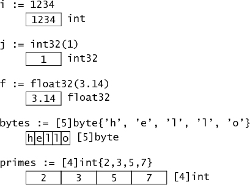
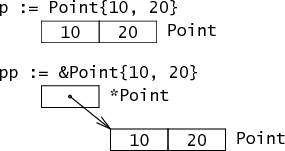
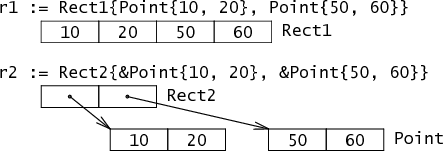

# Go数据底层的存储
> https://research.swtch.com/godata
## 基本数据类型

- 变量i具有类型int，在内存中表示为单个32位字。（所有这些图片显示的是32位内存布局;在当前实现中，只有指针在64位机器上变大 - int仍然是32位 - 尽管实现可以选择使用64位代替。）

- 由于显式转换，变量j具有类型int32。即使i并且j具有相同的内存布局，它们也有不同的类型：赋值i = j是类型错误，必须使用显式转换编写：i = int(j)。

- 变量f具有类型float，当前实现表示为32位浮点值。它具有与int32内部布局相同的内存占用。

## Structs and pointers
```
type Point struct { X, Y int }
```
定义一个名为Point的简单结构类型,在内存中表示为两个相邻的int


结构中的字段在内存中并排排列
```
type Rect1 struct { Min, Max Point }
type Rect2 struct { Min, Max *Point }
```

Rect1，具有两个Point字段的结构，由两个Point-4个整数表示。Rect2，一个包含两个`*Point`字段的结构，由两个`*Points` 表示。
## Strings

字符串在内存中表示为包含指向字符串数据的指针和长度两个字段。

因为字符串是不可变的，所以多个字符串共享相同的存储是安全的，因此切片会产生一个新的2个字段的结构，其中可能有不同的指针和长度仍然指向相同的字节序列。

## slice

切片是对数组的引用。在内存中，它包含3个字段，包含指向第一个元素的指针，切片的长度和容量。长度是索引操作的上限，例如x[i]，容量是切片操作的上限，例如x[i:j]。
## New and Make


make用于内建类型（map、slice 和channel）的内存分配。new用于各种类型的内存分配。

内建函数new本质上说跟其它语言中的同名函数功能一样：new(T)分配了零值填充的T类型的内存空间，并且返回其地址，即一个*T类型的值。用Go的术语说，它返回了一个指针，指向新分配的类型T的零值。
> 有一点非常重要：new返回指针。

内建函数make(T, args)与new(T)有着不同的功能，make只能创建slice、map和channel，并且返回一个有初始值(非零)的T类型，而不是*T。本质来讲，导致这三个类型有所不同的原因是指向数据结构的引用在使用前必须被初始化。例如，一个slice，是一个包含指向数据（内部array）的指针、长度和容量的三项描述符；在这些项目被初始化之前，slice为nil。对于slice、map和channel来说，make初始化了内部的数据结构，填充适当的值。
> make返回初始化后的（非零）值。