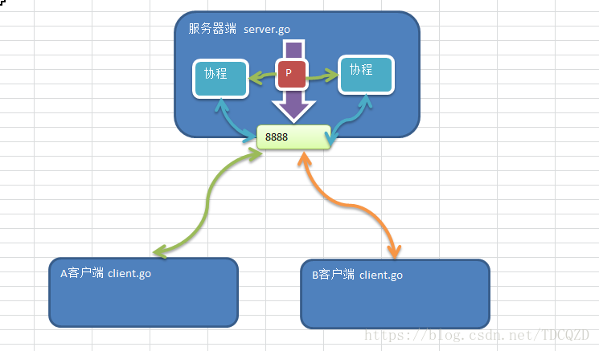

## TCP快速入门案例
### 1、服务端 
服务端的处理流程：

- 监听端口 8888
- 接收客户端的tcp链接，建立客户端和服务器端的链接.
- 创建goroutine，处理该链接的请求(通常客户端会通过链接发送请求包)

### 2、客户端

客户端的处理流程：

- 建立与服务端的链接
- 发送请求数据[终端]，接收服务器端返回的结果数据
- 关闭链接
### 3、简单的程序示意图 

### 4、服务器端功能:

1. 编写一个服务器端程序，在8888端口监听
2. 可以和多个客户端创建
3. 链接链接成功后，客户端可以发送数据，服务器端接受数据，并显示在终端上4. 先使用telnet 来测试，然后编写客户端程序来测试
### 5、客户端功能: 
1. 编写一个客户端端程序，能链接到 服务器端的8888端口 
2. 客户端可以发送单行数据，然后就退出 
3. 能通过终端输入数据(输入一行发送一行), 并发送给服务器端 [] 
4. 在终端输入exit,表示退出程序.