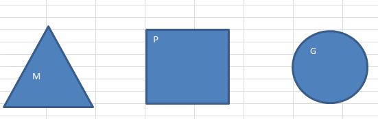
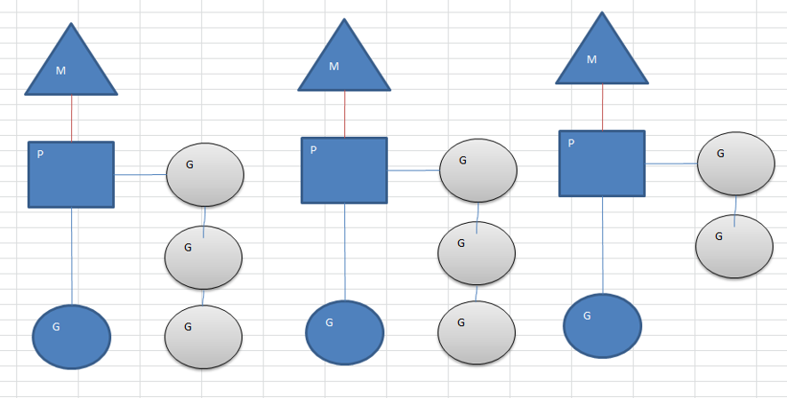
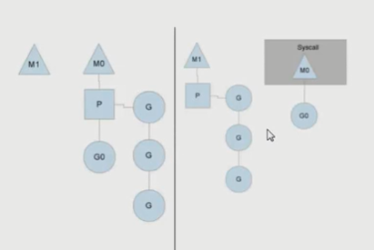
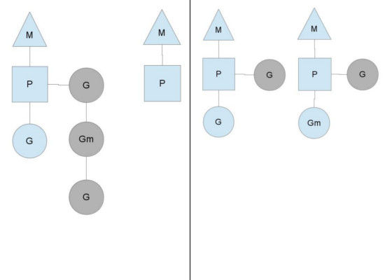

# 并发模型

## 并发(concurrency)和并行(parallellism)
并发(concurrency)：两个或两个以上的任务在一段时间内被执行。我们不必care这些任务在某一个时间点是否是同时执行，可能同时执行，也可能不是，我们只关心在一段时间内，哪怕是很短的时间（一秒或者两秒）是否执行解决了两个或两个以上任务。

并行(parallellism)：两个或两个以上的任务在同一时刻被同时执行。

并发说的是逻辑上的概念，而并行，强调的是物理运行状态。并发“包含”并行。

## Go的CSP并发模型
Go实现了两种并发形式。

第一种是大家普遍认知的：多线程共享内存。其实就是Java或者C++等语言中的多线程开发。另外一种是Go语言特有的，也是Go语言推荐的：CSP（communicating sequential processes）并发模型。

普通的线程并发模型，就是像Java、C++、或者Python，他们线程间通信都是通过共享内存的方式来进行的。非常典型的方式就是，在访问共享数据（例如数组、Map、或者某个结构体或对象）的时候，通过锁来访问，因此，在很多时候，衍生出一种方便操作的数据结构，叫做“线程安全的数据结构”。例如Java提供的包”java.util.concurrent”中的数据结构。Go中也实现了传统的线程并发模型。

Go的CSP并发模型，是通过goroutine和channel来实现的。
- goroutine 是Go语言中并发的执行单位。有点抽象，其实就是和传统概念上的”线程“类似，可以理解为”线程“。
- channel是Go语言中各个并发结构体(goroutine)之前的通信机制。 通俗的讲，就是各个goroutine之间通信的”管道“，有点类似于Linux中的管道。

## goroutine的调度模型
groutine能拥有强大的并发实现是通过MPG调度模型实现.
### MPG模式基本介绍

Go的调度器内部有三个重要的结构：M，P，S
- M:代表真正的内核OS线程，和POSIX里的thread差不多，真正干活的人
- G:代表一个goroutine，它有自己的栈，instruction pointer和其他信息（正在等待的channel等等），用于调度。
- P:代表调度的上下文，可以把它看做一个局部的调度器，使go代码在一个线程上跑，它是实现从N:1到N:M映射的关键。

### MPG模式运行的状态1

- 当前程序有三个M, 如果三个M都在一个cpu运行，就是并发，如果在不同的cpu运行就是并行
- M1,M2,M3正在执行一个G，M1的协程队列有三个，M2的协程队列有3个， M3协程队列有2个
- 从上图可以看到: Go的协程是轻量级的线程，是逻辑态的，Go可以容易的起上万个协程。
- 其它程序c/java的多线程，往往是内核态的，比较重量级，几千个线程可能耗光cpu

图中看，有2个物理线程M，每一个M都拥有一个context（P），每一个也都有一个正在运行的goroutine。

P的数量可以通过GOMAXPROCS()来设置，它其实也就代表了真正的并发度，即有多少个goroutine可以同时运行。

图中灰色的那些goroutine并没有运行，而是出于ready的就绪态，正在等待被调度。P维护着这个队列（称之为runqueue），Go语言里，启动一个goroutine很容易：go function 就行，所以每有一个go语句被执行，runqueue队列就在其末尾加入一个goroutine，在下一个调度点，就从runqueue中取出（如何决定取哪个goroutine？）一个goroutine执行。

为何要维护多个上下文P？因为当一个OS线程被阻塞时，P可以转而投奔另一个OS线程！
图中看到，当一个OS线程M0陷入阻塞时，P转而在OS线程M1上运行。调度器保证有足够的线程来运行所以的context P。

### MPG模式运行的状态2

图中的M1可能是被创建，或者从线程缓存中取出。
当MO返回时，它必须尝试取得一个context P来运行goroutine，一般情况下，它会从其他的OS线程那里steal偷一个context过来，如果没有偷到的话，它就把goroutine放在一个global runqueue里，然后自己就去睡大觉了（放入线程缓存里）。Contexts们也会周期性的检查global runqueue，否则global runqueue上的goroutine永远无法执行。

另一种情况是P所分配的任务G很快就执行完了（分配不均），这就导致了一个上下文P闲着没事儿干而系统却任然忙碌。但是如果global runqueue没有任务G了，那么P就不得不从其他的上下文P那里拿一些G来执行。一般来说，如果上下文P从其他的上下文P那里要偷一个任务的话，一般就‘偷’run queue的一半，这就确保了每个OS线程都能充分的使用。

## 参考资料：
[go-scheduler](http://morsmachine.dk/go-scheduler)
