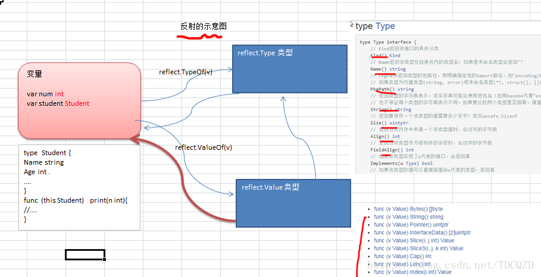

# 反射
Go语言实现了反射，所谓反射就是能检查程序在运行时的状态。我们一般用到的包是reflect包
## 反射的基本介绍
1. 反射可以在运行时动态获取变量的各种信息, 比如变量的类型(type)，类别(kind) 
2. 如果是结构体变量，还可以获取到结构体本身的信息(包括结构体的字段、方法) 
3. 通过反射，可以修改变量的值，可以调用关联的方法。 
4. 使用反射，需要 import (“reflect”) 
5. 示意图

## 反射的应用场景
1、反射常见应用场景有以下两种 
不知道接口调用哪个函数，根据传入参数在运行时确定调用的具体接口，这种需要对函数或方法反射。例如以下这种桥接模式, 比如我前面提出问题。

第一个参数funcPtr以接口的形式传入函数指针，函数参数args以可变参数的形式传入，bridge函数中可以用反射来动态执行funcPtr函数 
2、对结构体序列化时，如果结构体有指定Tag, 也会使用到反射生成对应的字符串。

## 使用reflect
使用reflect一般分成三步，下面简要的讲解一下：要去反射是一个类型的值(这些值都实现了空interface)，首先需要把它转化成reflect对象(reflect.Type或者reflect.Value，根据不同的情况调用不同的函数)。这两种获取方式如下：
```
t := reflect.TypeOf(i)    //得到类型的元数据,通过t我们能获取类型定义里面的所有元素
v := reflect.ValueOf(i)   //得到实际的值，通过v我们获取存储在里面的值，还可以去改变值
```
转化为reflect对象之后我们就可以进行一些操作了，也就是将reflect对象转化成相应的值，例如
```
tag := t.Elem().Field(0).Tag  //获取定义在struct里面的标签
name := v.Elem().Field(0).String()  //获取存储在第一个字段里面的值
```
获取反射值能返回相应的类型和数值
```
var x float64 = 3.4
v := reflect.ValueOf(x)
fmt.Println("type:", v.Type())
fmt.Println("kind is float64:", v.Kind() == reflect.Float64)
fmt.Println("value:", v.Float())
```
最后，反射的话，那么反射的字段必须是可修改的，我们前面学习过传值和传引用，这个里面也是一样的道理。反射的字段必须是可读写的意思是，如果下面这样写，那么会发生错误
```
var x float64 = 3.4
v := reflect.ValueOf(x)
v.SetFloat(7.1)
```
如果要修改相应的值，必须这样写
```
var x float64 = 3.4
p := reflect.ValueOf(&x)
v := p.Elem()
v.SetFloat(7.1)
```