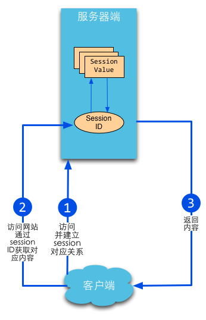

# session
Web开发中一个很重要的议题就是如何做好用户的整个浏览过程的控制，因为HTTP协议是无状态的，所以用户的每一次请求都是无状态的，我们不知道在整个Web操作过程中哪些连接与该用户有关，我们应该如何来解决这个问题呢？Web里面经典的解决方案是cookie和session

- cookie机制是一种客户端机制，把用户数据保存在客户端，
- 而session机制是一种服务器端的机制，服务器使用一种类似于散列表的结构来保存信息，每一个网站访客都会被分配给一个唯一的标志符,即sessionID,它的存放形式无非两种:要么经过url传递,要么保存在客户端的cookies里.当然,你也可以将Session保存到数据库里,这样会更安全,但效率方面会有所下降。

## session和cookie
### cookie
cookie，简而言之就是在本地计算机保存一些用户操作的历史信息（当然包括登录信息），并在用户再次访问该站点时浏览器通过HTTP协议将本地cookie内容发送给服务器，从而完成验证，或继续上一步操作。

cookie的原理图如下：


Cookie是由浏览器维持的，存储在客户端的一小段文本信息，伴随着用户请求和页面在Web服务器和浏览器之间传递。用户每次访问站点时，Web应用程序都可以读取cookie包含的信息。

cookie是有时间限制的，根据生命期不同分成两种：会话cookie和持久cookie；

- 如果不设置过期时间，则表示这个cookie生命周期为从创建到浏览器关闭止，只要关闭浏览器窗口，cookie就消失了。这种生命期为浏览会话期的cookie被称为会话cookie。会话cookie一般不保存在硬盘上而是保存在内存里。

- 如果设置了过期时间(setMaxAge(60_60_24))，浏览器就会把cookie保存到硬盘上，关闭后再次打开浏览器，这些cookie依然有效直到超过设定的过期时间。存储在硬盘上的cookie可以在不同的浏览器进程间共享，比如两个IE窗口。而对于保存在内存的cookie，不同的浏览器有不同的处理方式。

### session
session，简而言之就是在服务器上保存用户操作的历史信息。服务器使用session id来标识session，session id由服务器负责产生，保证随机性与唯一性，相当于一个随机密钥，避免在握手或传输中暴露用户真实密码。但该方式下，仍然需要将发送请求的客户端与session进行对应，所以可以借助cookie机制来获取客户端的标识（即session id），也可以通过GET方式将id提交给服务器。



session，中文经常翻译为会话，其本来的含义是指有始有终的一系列动作/消息，比如打电话是从拿起电话拨号到挂断电话这中间的一系列过程可以称之为一个session。然而当session一词与网络协议相关联时，它又往往隐含了“面向连接”和/或“保持状态”这样两个含义。

session在Web开发环境下的语义又有了新的扩展，它的含义是指一类用来在客户端与服务器端之间保持状态的解决方案。有时候Session也用来指这种解决方案的存储结构。

session机制是一种服务器端的机制，服务器使用一种类似于散列表的结构(也可能就是使用散列表)来保存信息。

但程序需要为某个客户端的请求创建一个session的时候，服务器首先检查这个客户端的请求里是否包含了一个session标识－称为session id，如果已经包含一个session id则说明以前已经为此客户创建过session，服务器就按照session id把这个session检索出来使用(如果检索不到，可能会新建一个，这种情况可能出现在服务端已经删除了该用户对应的session对象，但用户人为地在请求的URL后面附加上一个JSESSION的参数)。如果客户请求不包含session id，则为此客户创建一个session并且同时生成一个与此session相关联的session id，这个session id将在本次响应中返回给客户端保存。

session机制本身并不复杂，然而其实现和配置上的灵活性却使得具体情况复杂多变。这也要求我们不能把仅仅某一次的经验或者某一个浏览器，服务器的经验当作普遍适用的。

### Go设置cookie
Go语言中通过net/http包中的SetCookie来设置：
```
http.SetCookie(w ResponseWriter, cookie *Cookie)
```
cookie对象
```
type Cookie struct {
    Name       string
    Value      string
    Path       string
    Domain     string
    Expires    time.Time
    RawExpires string

// MaxAge=0 means no 'Max-Age' attribute specified.
// MaxAge<0 means delete cookie now, equivalently 'Max-Age: 0'
// MaxAge>0 means Max-Age attribute present and given in seconds
    MaxAge   int
    Secure   bool
    HttpOnly bool
    Raw      string
    Unparsed []string // Raw text of unparsed attribute-value pairs
}
```
设置cookie
```
expiration := time.Now()
expiration = expiration.AddDate(1, 0, 0)
cookie := http.Cookie{Name: "username", Value: "astaxie", Expires: expiration}
http.SetCookie(w, &cookie)
```
Go读取cookie
```
cookie, _ := r.Cookie("username")
fmt.Fprint(w, cookie)
```
or
```
for _, cookie := range r.Cookies() {
    fmt.Fprint(w, cookie.Name)
}
```

### 总结
session和cookie的目的相同，都是为了克服http协议无状态的缺陷，但完成的方法不同。session通过cookie，在客户端保存session id，而将用户的其他会话消息保存在服务端的session对象中，与此相对的，cookie需要将所有信息都保存在客户端。因此cookie存在着一定的安全隐患，例如本地cookie中保存的用户名密码被破译，或cookie被其他网站收集
## Go如何使用session
### session创建过程
session的基本原理是由服务器为每个会话维护一份信息数据，客户端和服务端依靠一个全局唯一的标识来访问这份数据，以达到交互的目的。当用户访问Web应用时，服务端程序会随需要创建session，这个过程可以概括为三个步骤：

- 生成全局唯一标识符（sessionid）；
- 开辟数据存储空间。一般会在内存中创建相应的数据结构，但这种情况下，系统一旦掉电，所有的会话数据就会丢失，如果是电子商务类网站，这将造成严重的后果。所以为了解决这类问题，你可以将会话数据写到文件里或存储在数据库中，当然这样会增加I/O开销，但是它可以实现某种程度的session持久化，也更有利于session的共享；
- 将session的全局唯一标示符发送给客户端。
以上三个步骤中，最关键的是如何发送这个session的唯一标识这一步上。考虑到HTTP协议的定义，数据无非可以放到请求行、头域或Body里，所以一般来说会有两种常用的方式：cookie和URL重写。

1. Cookie 服务端通过设置Set-cookie头就可以将session的标识符传送到客户端，而客户端此后的每一次请求都会带上这个标识符，另外一般包含session信息的cookie会将失效时间设置为0(会话cookie)，即浏览器进程有效时间。至于浏览器怎么处理这个0，每个浏览器都有自己的方案，但差别都不会太大(一般体现在新建浏览器窗口的时候)；
2. URL重写 所谓URL重写，就是在返回给用户的页面里的所有的URL后面追加session标识符，这样用户在收到响应之后，无论点击响应页面里的哪个链接或提交表单，都会自动带上session标识符，从而就实现了会话的保持。虽然这种做法比较麻烦，但是，如果客户端禁用了cookie的话，此种方案将会是首选。
### Go实现session管理
**session管理设计**
ession管理涉及到如下几个因素

- 全局session管理器
- 保证sessionid 的全局唯一性
- 为每个客户关联一个session
- session 的存储(可以存储到内存、文件、数据库等)
- session 过期处理

**session管理**

1. 定义一个全局的session管理器
2. 抽象出一个Provider接口，用以表征session管理器底层存储结构。
3. 实现Session接口，对Session的处理： 设置值、读取值、删除值以及获取当前sessionID这四个操作
4. Register函数实现随需注册存储session的结构

**session 使用**

1. 在main包中创建一个全局的session管理器
## session存储

## 预防session劫持
session劫持是一种广泛存在的比较严重的安全威胁，在session技术中，客户端和服务端通过session的标识符来维护会话， 但这个标识符很容易就能被嗅探到，从而被其他人利用.它是中间人攻击的一种类型。

### session劫持防范
如何有效的防止session劫持呢？
**cookieonly和token**
其中一个解决方案就是sessionID的值只允许cookie设置，而不是通过URL重置方式设置，同时设置cookie的httponly为true,这个属性是设置是否可通过客户端脚本访问这个设置的cookie，第一这个可以防止这个cookie被XSS读取从而引起session劫持，第二cookie设置不会像URL重置方式那么容易获取sessionID。

第二步就是在每个请求里面加上token，实现类似前面章节里面讲的防止form重复递交类似的功能，我们在每个请求里面加上一个隐藏的token，然后每次验证这个token，从而保证用户的请求都是唯一性。
```
h := md5.New()
salt:="astaxie%^7&8888"
io.WriteString(h,salt+time.Now().String())
token:=fmt.Sprintf("%x",h.Sum(nil))
if r.Form["token"]!=token{
    //提示登录
}
sess.Set("token",token)
```
**间隔生成新的SID**
还有一个解决方案就是，我们给session额外设置一个创建时间的值，一旦过了一定的时间，我们销毁这个sessionID，重新生成新的session，这样可以一定程度上防止session劫持的问题。
```
createtime := sess.Get("createtime")
if createtime == nil {
    sess.Set("createtime", time.Now().Unix())
} else if (createtime.(int64) + 60) < (time.Now().Unix()) {
    globalSessions.SessionDestroy(w, r)
    sess = globalSessions.SessionStart(w, r)
}
```
session启动后，我们设置了一个值，用于记录生成sessionID的时间。通过判断每次请求是否过期(这里设置了60秒)定期生成新的ID，这样使得攻击者获取有效sessionID的机会大大降低。

上面两个手段的组合可以在实践中消除session劫持的风险，一方面， 由于sessionID频繁改变，使攻击者难有机会获取有效的sessionID；另一方面，因为sessionID只能在cookie中传递，然后设置了httponly，所以基于URL攻击的可能性为零，同时被XSS获取sessionID也不可能。最后，由于我们还设置了MaxAge=0，这样就相当于session cookie不会留在浏览器的历史记录里面。


