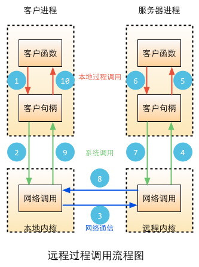

# Web服务
目前主流的有如下几种Web服务：REST、SOAP。

REST请求是很直观的，因为REST是基于HTTP协议的一个补充，他的每一次请求都是一个HTTP请求，然后根据不同的method来处理不同的逻辑，很多Web开发者都熟悉HTTP协议，所以学习REST是一件比较容易的事情。

SOAP是W3C在跨网络信息传递和远程计算机函数调用方面的一个标准。但是SOAP非常复杂，其完整的规范篇幅很长，而且内容仍然在增加。

Go语言提供了RPC机制。
## Socket编程
Socket有两种：TCP Socket和UDP Socket，TCP和UDP是协议，而要确定一个进程的需要三元组，需要IP地址和端口。

### Go支持的IP类型
在Go的net包中定义了很多类型、函数和方法用来网络编程，其中IP的定义如下：
```
type IP []byte
```
在net包中有很多函数来操作IP，但是其中比较有用的也就几个，其中`ParseIP(s string)` IP函数会把一个IPv4或者IPv6的地址转化成IP类型
### TCP Socket
在Go语言的net包中有一个类型TCPConn，这个类型可以用来作为客户端和服务器端交互的通道，他有两个主要的函数：
```
func (c *TCPConn) Write(b []byte) (n int, err os.Error)
func (c *TCPConn) Read(b []byte) (n int, err os.Error)
```
TCPConn可以用在客户端和服务器端来读写数据。

TCPAddr类型，表示一个TCP的地址信息，他的定义如下：
```
type TCPAddr struct {
    IP IP
    Port int
}
```
在Go语言中通过ResolveTCPAddr获取一个TCPAddr
```
func ResolveTCPAddr(net, addr string) (*TCPAddr, os.Error)
```
- net参数是"tcp4"、"tcp6"、"tcp"中的任意一个，分别表示TCP(IPv4-only),TCP(IPv6-only)或者TCP(IPv4,IPv6的任意一个).
- addr表示域名或者IP地址，例如"www.google.com:80" 或者"127.0.0.1:22".

**TCP client**

Go语言中通过net包中的DialTCP函数来建立一个TCP连接，并返回一个TCPConn类型的对象，当连接建立时服务器端也创建一个同类型的对象，此时客户端和服务器段通过各自拥有的TCPConn对象来进行数据交换。一般而言，客户端通过TCPConn对象将请求信息发送到服务器端，读取服务器端响应的信息。服务器端读取并解析来自客户端的请求，并返回应答信息，这个连接只有当任一端关闭了连接之后才失效，不然这连接可以一直在使用。建立连接的函数定义如下：
```
func DialTCP(net string, laddr, raddr *TCPAddr) (c *TCPConn, err os.Error)
```
- net参数是"tcp4"、"tcp6"、"tcp"中的任意一个，分别表示TCP(IPv4-only)、TCP(IPv6-only)或者TCP(IPv4,IPv6的任意一个)
- laddr表示本机地址，一般设置为nil
- raddr表示远程的服务地址

**TCP server**

可以通过net包来创建一个服务器端程序，在服务器端我们需要绑定服务到指定的非激活端口，并监听此端口，当有客户端请求到达的时候可以接收到来自客户端连接的请求。net包中有相应功能的函数，函数定义如下：
```
func ListenTCP(net string, laddr *TCPAddr) (l *TCPListener, err os.Error)
func (l *TCPListener) Accept() (c Conn, err os.Error)
```
参数说明同DialTCP的参数一样。

**控制TCP连接**

TCP有很多连接控制函数，我们平常用到比较多的有如下几个函数：
```
func DialTimeout(net, addr string, timeout time.Duration) (Conn, error)
```
设置建立连接的超时时间，客户端和服务器端都适用，当超过设置时间时，连接自动关闭。
```
func (c *TCPConn) SetReadDeadline(t time.Time) error
func (c *TCPConn) SetWriteDeadline(t time.Time) error
```
用来设置写入/读取一个连接的超时时间。当超过设置时间时，连接自动关闭。
```
func (c *TCPConn) SetKeepAlive(keepalive bool) os.Error
```
设置客户端是否和服务器端保持长连接，可以降低建立TCP连接时的握手开销，对于一些需要频繁交换数据的应用场景比较适用。

### UDP Socket
Go语言包中处理UDP Socket和TCP Socket不同的地方就是在服务器端处理多个客户端请求数据包的方式不同,UDP缺少了对客户端连接请求的Accept函数。其他基本几乎一模一样，只有TCP换成了UDP而已。UDP的几个主要函数如下所示：
```
func ResolveUDPAddr(net, addr string) (*UDPAddr, os.Error)
func DialUDP(net string, laddr, raddr *UDPAddr) (c *UDPConn, err os.Error)
func ListenUDP(net string, laddr *UDPAddr) (c *UDPConn, err os.Error)
func (c *UDPConn) ReadFromUDP(b []byte) (n int, addr *UDPAddr, err os.Error
func (c *UDPConn) WriteToUDP(b []byte, addr *UDPAddr) (n int, err os.Error)
```

## WebSocket
WebSocket是HTML5的重要特性，它实现了基于浏览器的远程socket，它使浏览器和服务器可以进行全双工通信，许多浏览器（Firefox、Google Chrome和Safari）都已对此做了支持。

在WebSocket出现之前，为了实现即时通信，采用的技术都是“轮询”，即在特定的时间间隔内，由浏览器对服务器发出HTTP Request，服务器在收到请求后，返回最新的数据给浏览器刷新，“轮询”使得浏览器需要对服务器不断发出请求，这样会占用大量带宽。

WebSocket采用了一些特殊的报头，使得浏览器和服务器只需要做一个握手的动作，就可以在浏览器和服务器之间建立一条连接通道。且此连接会保持在活动状态，你可以使用JavaScript来向连接写入或从中接收数据，就像在使用一个常规的TCP Socket一样。它解决了Web实时化的问题，相比传统HTTP有如下好处：

- 一个Web客户端只建立一个TCP连接
- Websocket服务端可以推送(push)数据到web客户端.
- 有更加轻量级的头，减少数据传送量

WebSocket URL的起始输入是ws://或是wss://（在SSL上）。下图展示了WebSocket的通信过程，一个带有特定报头的HTTP握手被发送到了服务器端，接着在服务器端或是客户端就可以通过JavaScript来使用某种套接口（socket），这一套接口可被用来通过事件句柄异步地接收数据。


### WebSocket原理
WebSocket的协议颇为简单，在第一次handshake通过以后，连接便建立成功，其后的通讯数据都是以”\x00″开头，以”\xFF”结尾。在客户端，这个是透明的，WebSocket组件会自动将原始数据“掐头去尾”。

浏览器发出WebSocket连接请求，然后服务器发出回应，然后连接建立成功，这个过程通常称为“握手” (handshaking)。请看下面的请求和反馈信息：


在请求中的"Sec-WebSocket-Key"是随机的,这是一个经过base64编码后的数据。服务器端接收到这个请求之后需要把这个字符串连接上一个固定的字符串：
```
258EAFA5-E914-47DA-95CA-C5AB0DC85B11
```
即：f7cb4ezEAl6C3wRaU6JORA==连接上那一串固定字符串，生成一个这样的字符串：
```
f7cb4ezEAl6C3wRaU6JORA==258EAFA5-E914-47DA-95CA-C5AB0DC85B11
```
对该字符串先用 sha1安全散列算法计算出二进制的值，然后用base64对其进行编码，即可以得到握手后的字符串：
```
rE91AJhfC+6JdVcVXOGJEADEJdQ=
```
将之作为响应头Sec-WebSocket-Accept的值反馈给客户端。

### Go实现WebSocket
Go语言标准包里面没有提供对WebSocket的支持，但是在由官方维护的go.net子包中有对这个的支持，你可以通过如下的命令获取该包：
```
go get code.google.com/p/go.net/websocket
```
WebSocket分为客户端和服务端.

**示例**

用户输入信息，客户端通过WebSocket将信息发送给服务器端，服务器端收到信息之后主动Push信息到客户端，然后客户端将输出其收到的信息。

客户端：

通过WebSocket函数建立了一个与服务器的连接sock，当握手成功后，会触发WebScoket对象的onopen事件，告诉客户端连接已经成功建立。客户端一共绑定了四个事件。

- 1）onopen 建立连接后触发
- 2）onmessage 收到消息后触发
- 3）onerror 发生错误时触发
- 4）onclose 关闭连接时触发

服务端：

客户端将用户输入的信息Send之后，服务器端通过Receive接收到了相应信息，然后通过Send发送了应答信息。
```
Received back from client: Hello, world!
Sending to client: Received:  Hello, world!
Received back from client: Hello, WebSocket !
Sending to client: Received:  Hello, WebSocket !
```
**WebSocket 框架**
* [gorilla/websocket](https://github.com/gorilla/websocket)
## REST
RESTful，是目前最为流行的一种互联网软件架构。因为它结构清晰、符合标准、易于理解、扩展方便，所以正得到越来越多网站的采用。

REST是一种架构风格，汲取了WWW的成功经验：无状态，以资源为中心，充分利用HTTP协议和URI协议，提供统一的接口定义，使得它作为一种设计Web服务的方法而变得流行。在某种意义上，通过强调URI和HTTP等早期Internet标准，REST是对大型应用程序服务器时代之前的Web方式的回归。目前Go对于REST的支持还是很简单的，通过实现自定义的路由规则，我们就可以为不同的method实现不同的handle，这样就实现了REST的架构。
## RPC
RPC（Remote Procedure Call Protocol）——远程过程调用协议，是一种通过网络从远程计算机程序上请求服务，而不需要了解底层网络技术的协议。它假定某些传输协议的存在，如TCP或UDP，以便为通信程序之间携带信息数据。通过它可以使函数调用模式网络化。在OSI网络通信模型中，RPC跨越了传输层和应用层。RPC使得开发包括网络分布式多程序在内的应用程序更加容易。


运行时,一次客户机对服务器的RPC调用,其内部操作大致有如下十步：

1. 调用客户端句柄；执行传送参数
2. 调用本地系统内核发送网络消息
3. 消息传送到远程主机
4. 服务器句柄得到消息并取得参数
5. 执行远程过程
6. 执行的过程将结果返回服务器句柄
7. 服务器句柄返回结果，调用远程系统内核
8. 消息传回本地主机
9. 客户句柄由内核接收消息
10. 客户接收句柄返回的数据

### Go RPC
Go标准包中已经提供了对RPC的支持，而且支持三个级别的RPC：TCP、HTTP、JSONRPC。但Go的RPC包是独一无二的RPC，它和传统的RPC系统不同，它只支持Go开发的服务器与客户端之间的交互，因为在内部，它们采用了Gob来编码。

Go RPC的函数只有符合下面的条件才能被远程访问，不然会被忽略，详细的要求如下：

- 函数必须是导出的(首字母大写)
- 必须有两个导出类型的参数，
- 第一个参数是接收的参数，第二个参数是返回给客户端的参数，第二个参数必须是指针类型的
- 函数还要有一个返回值error

**HTTP RPC**

**TCP RPC**

**JSON RPC**

**grpc**

**protorpc**