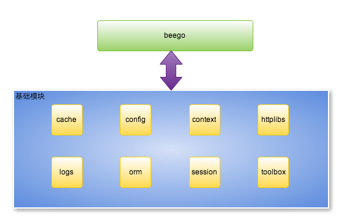

# beego
beego 是一个快速开发 Go 应用的 HTTP 框架，他可以用来快速开发 API、Web 及后端服务等各种应用，是一个**RESTful 的框架**，主要设计灵感来源于 tornado、sinatra 和 flask 这三个框架，但是结合了 Go 本身的一些特性（interface、struct 嵌入等）而设计的一个框架。

## beego 的架构
beego 的整体设计架构如下所示：


## beego 的执行逻辑
既然 beego 是基于这些模块构建的，那么它的执行逻辑是怎么样的呢？beego 是一个典型的 MVC 架构，它的执行逻辑如下图所示：


## beego 项目结构
一般的 beego 项目的目录如下所示：
```
BeegoDemo
├── conf
│   └── app.conf
├── controllers
│   ├── admin
│   └── default.go
├── main.go
├── models
│   └── models.go
├── static
│   ├── css
│   ├── ico
│   ├── img
│   └── js
└── views
    ├── admin
    └── index.tpl
```
从上面的目录结构我们可以看出来 M（models 目录）、V（views 目录）和 C（controllers 目录）的结构， main.go 是入口文件。

## 参考资料
* https://github.com/astaxie/beego
* https://beego.me/
* https://www.kancloud.cn/kancloud/web-application-with-golang/44110
