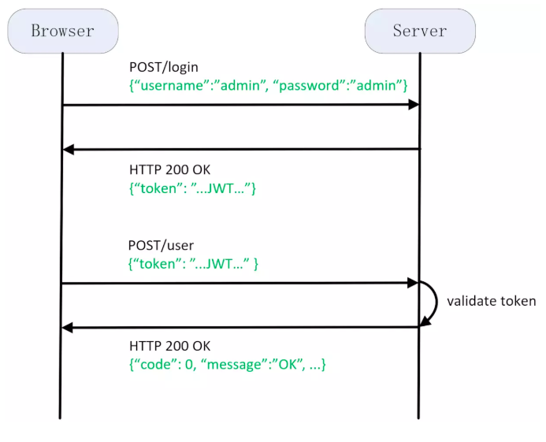

# JWT
在典型业务场景中，为了区分用户和安全保密，必须对 API 请求进行鉴权， 但是不能要求每一个请求都进行登录操作。合理做法是，在第一次登录之后产生一个有一定有效期的 token，并将其存储于浏览器的 Cookie 或 LocalStorage 之中，之后的请求都携带该 token ，请求到达服务器端后，服务器端用该 token 对请求进行鉴权。在第一次登录之后，服务器会将这个 token 用文件、数据库或缓存服务器等方法存下来，用于之后请求中的比对。或者，更简单的方法是，直接用密钥对用户信息和时间戳进行签名对称加密，这样就可以省下额外的存储，也可以减少每一次请求时对数据库的查询压力。这种方式，在业界已经有一种标准的实现方式，该方式被称为 JSON Web Token（JWT，音同 jot，详见 JWT RFC 7519）。

> token 的意思是“令牌”，里面包含了用于认证的信息。这里的 token 是指 JSON Web Token（JWT）。

1. 客户端使用用户名和密码请求登录
2. 服务端收到请求后会去验证用户名和密码，如果用户名和密码跟数据库记录不一致则验证失败，如果一致则验证通过，服务端会签发一个 Token 返回给客户端
3. 客户端收到请求后会将 Token 缓存起来，比如放在浏览器 Cookie 中或者本地存储中，之后每次请求都会携带该 Token
4. 服务端收到请求后会验证请求中携带的 Token，验证通过则进行业务逻辑处理并成功返

在 JWT 中，Token 有三部分组成，中间用 . 隔开，并使用 Base64 编码：
- header
- payload
- signature