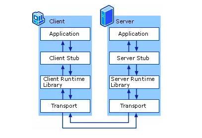
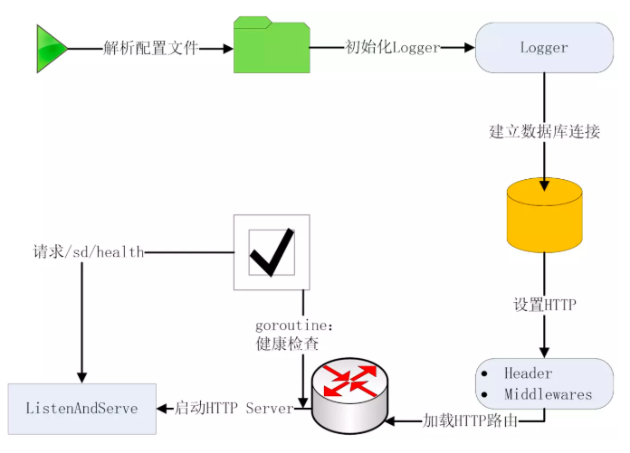
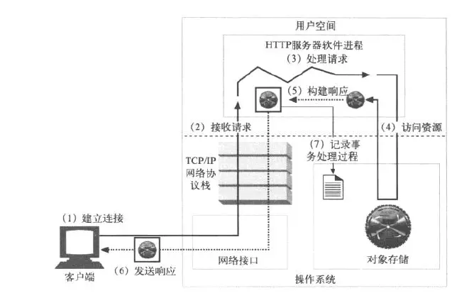
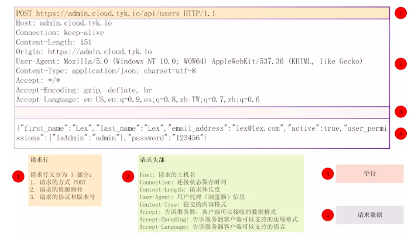

#  API 服务器
* http://www.dabland.cn
## 说明

### 目录如下：
1. 启动一个最简单的 RESTful API 服务器
2. 配置文件
3. 记录和管理 API 日志
4. MySQL 数据库配置并建立连接
5. 自定义业务错误信息
6. 读取和返回 HTTP 请求
7. 用户业务逻辑处理(CRUD)
8. HTTP 调用添加自定义处理逻辑
9. API 身份验证
    补充:单点登录
10. 用 HTTPS 加密 API 请求
11. 用 Makefile 管理 API 项目
12. 给 API 命令增加版本功能
13. 给 API 增加启动脚本
14. 基于 Nginx 的 API 部署方案
15. API 高可用方案
16. go test 测试代码
17. API 性能分析
18. 生成 Swagger 在线文档
19. API 性能测试和调优

### 代码

**1、CURL 工具**

CURL 工具不适应与Window环境

**2、导包**
```
"../handler/sd"
"../router/middleware"
```
以上导包方式错误。window环境不支持相对路径。Linux支持

## RESTful API 介绍
### 什么是 API
API（Application Programming Interface，应用程序编程接口）是一些预先定义的函数或者接口，目的是提供应用程序与开发人员基于某软件或硬件得以访问一组例程的能力，而又无须访问源码，或理解内部工作机制的细节。

要实现一个 API 服务器，首先要考虑两个方面：API 风格和媒体类型。Go 语言中常用的 API 风格是 RPC 和 REST，常用的媒体类型是 JSON、XML 和 Protobuf。在 Go API 开发中常用的组合是 gRPC + Protobuf 和 REST + JSON。
### REST 简介

REST 代表表现层状态转移（REpresentational State Transfer），由 Roy Fielding 在他的 论文 中提出。REST 是一种软件架构风格，不是技术框架，REST 有一系列规范，满足这些规范的 API 均可称为 RESTful API。REST 规范中有如下几个核心：

1. REST 中一切实体都被抽象成资源，每个资源有一个唯一的标识 —— URI，所有的行为都应该是在资源上的 CRUD 操作
2. 使用标准的方法来更改资源的状态，常见的操作有：资源的增删改查操作
3. 无状态：这里的无状态是指每个 RESTful API 请求都包含了所有足够完成本次操作的信息，服务器端无须保持 Session
>无状态对于服务端的弹性扩容是很重要的。

REST 风格虽然适用于很多传输协议，但在实际开发中，REST 由于天生和 HTTP 协议相辅相成，因此 HTTP 协议已经成了实现 RESTful API 事实上的标准。在 HTTP 协议中通过 POST、DELETE、PUT、GET 方法来对应 REST 资源的增、删、改、查操作，具体的对应关系如下：

| HTTP | 方法 | 行为 | URI | 示例说明 |
|------|-----|------|-----|--------|
| GET  | 获取资源列表 | /users | 获取用户列表 |
| GET  | 获取一个具体的资源 | /users/admin | 获取 admin 用户的详细信息 |
| POST | 创建一个新的资源 | /users | 创建一个新用户 |
| PUT  | 以整体的方式更新一个资源 | /users/1 | 更新 id 为 1 的用户 |
| DELETE | 删除服务器上的一个资源 | /users/1 | 删除 id 为 1 的用户 |


### RPC 简介
根据维基百科的定义：远程过程调用（Remote Procedure Call，RPC）是一个计算机通信协议。该协议允许运行于一台计算机的程序调用另一台计算机的子程序，而程序员无须额外地为这个交互作用编程。

通俗来讲，就是服务端实现了一个函数，客户端使用 RPC 框架提供的接口，调用这个函数的实现，并获取返回值。RPC 屏蔽了底层的网络通信细节，使得开发人员无须关注网络编程的细节，而将更多的时间和精力放在业务逻辑本身的实现上，从而提高开发效率。

RPC 的调用过程如下：


1. Client 通过本地调用，调用 Client Stub。
2. Client Stub 将参数打包（也叫 Marshalling）成一个消息，然后发送这个消息
3. Client 所在的 OS 将消息发送给 Server
4. Server 端接收到消息后，将消息传递给 Server Stub
5. Server Stub 将消息解包（也叫 Unmarshalling）得到参数
6. Server Stub 调用服务端的子程序（函数），处理完后，将最终结果按照相反的步骤返回给 Client
>Stub 负责调用参数和返回值的流化（serialization）、参数的打包解包，以及负责网络层的通信。Client 端一般叫 Stub，Server 端一般叫 Skeleton。

### REST vs RPC
在做 API 服务器开发时，很多人都会遇到这个问题 —— 选择 REST 还是 RPC。RPC 相比 REST 的优点主要有 3 点：

1. RPC+Protobuf 采用的是 TCP 做传输协议，REST 直接使用 HTTP 做应用层协议，这种区别导致 REST 在调用性能上会比 RPC+Protobuf 低
2. RPC 不像 REST 那样，每一个操作都要抽象成对资源的增删改查，在实际开发中，有很多操作很难抽象成资源，比如登录操作。所以在实际开发中并不能严格按照 REST 规范来写 API，RPC 就不存在这个问题
3. RPC 屏蔽网络细节、易用，和本地调用类似
这里的易用指的是调用方式上的易用性。在做 RPC 开发时，开发过程很烦琐，需要先写一个 DSL 描述文件，然后用代码生成器生成各种语言代码，当描述文件有更改时，必须重新定义和编译，维护性差。

但是 REST 相较 RPC 也有很多优势：

- 轻量级，简单易用，维护性和扩展性都比较好
- REST 相对更规范，更标准，更通用，无论哪种语言都支持 HTTP 协议，可以对接外部很多系统，只要满足 HTTP 调用即可，更适合对外，RPC 会有语言限制，不同语言的 RPC 调用起来很麻烦
- JSON 格式可读性更强，开发调试都很方便
- 在开发过程中，如果严格按照 REST 规范来写 API，API 看起来更清晰，更容易被大家理解
>在实际开发中，严格按照 REST 规范来写很难，只能尽可能 RESTful 化。

其实业界普遍采用的做法是，内部系统之间调用用 RPC，对外用 REST，因为内部系统之间可能调用很频繁，需要 RPC 的高性能支撑。对外用 REST 更易理解，更通用些。当然以现有的服务器性能，如果两个系统间调用不是特别频繁，对性能要求不是非常高，以笔者的开发经验来看，REST 的性能完全可以满足。本小册不是讨论微服务，所以不存在微服务之间的高频调用场景，此外 REST 在实际开发中，能够满足绝大部分的需求场景，所以 RPC 的性能优势可以忽略，相反基于 REST 的其他优势，笔者更倾向于用 REST 来构建 API 服务器，本小册正是用 REST 风格来构建 API 的。

### 媒体类型选择
媒体类型是独立于平台的类型，设计用于分布式系统间的通信，媒体类型用于传递信息，一个正式的规范定义了这些信息应该如何表示。HTTP 的 REST 能够提供多种不同的响应形式，常见的是 XML 和 JSON。JSON 无论从形式上还是使用方法上都更简单。相比 XML，JSON 的内容更加紧凑，数据展现形式直观易懂，开发测试都非常方便，所以在媒体类型选择上，选择了 JSON 格式，这也是很多大公司所采用的格式。

## API 流程和代码结构

为了使大家在开始实战之前对 API 开发有个整体的了解，这里选择了两个流程来介绍：

- HTTP API 服务器启动流程
- HTTP 请求处理流程

### HTTP API 服务器启动流程


如上图，在启动一个 API 命令后，API 命令会首先加载配置文件，根据配置做后面的处理工作。通常会将日志相关的配置记录在配置文件中，在解析完配置文件后，就可以加载日志包初始化函数，来初始化日志实例，供后面的程序调用。接下来会初始化数据库实例，建立数据库连接，供后面对数据库的 CRUD 操作使用。在建立完数据库连接后，需要设置 HTTP，通常包括 3 方面的设置：

- 设置 Header
- 注册路由
- 注册中间件
之后会调用net/http包的ListenAndServe()方法启动 HTTP 服务器。

在启动 HTTP 端口之前，程序会 go 一个协程，来 ping HTTP 服务器的 /sd/health 接口，如果程序成功启动，ping 协程在 timeout 之前会成功返回，如果程序启动失败，则 ping 协程最终会 timeout，并终止整个程序。

>解析配置文件、初始化 Log 、初始化数据库的顺序根据自己的喜好和需求来排即可。

### HTTP 请求处理流程

一次完整的 HTTP 请求处理流程如上图所示。

**1. 建立连接**

客户端发送 HTTP 请求后，服务器会根据域名进行域名解析，就是将网站名称转变成 IP 地址：localhost -> 127.0.0.1，Linux hosts文件、DNS 域名解析等可以实现这种功能。之后通过发起 TCP 的三次握手建立连接。TCP 三次连接请参考 TCP 三次握手详解及释放连接过程，建立连接之后就可以发送 HTTP 请求了。

**2. 接收请求**

HTTP 服务器软件进程，这里指的是 API 服务器，在接收到请求之后，首先根据 HTTP 请求行的信息来解析到 HTTP 方法和路径，在上图所示的报文中，方法是 GET，路径是 /index.html，之后根据 API 服务器注册的路由信息（大概可以理解为：HTTP 方法 + 路径和具体处理函数的映射）找到具体的处理函数。

**3. 处理请求**

在接收到请求之后，API 通常会解析 HTTP 请求报文获取请求头和消息体，然后根据这些信息进行相应的业务处理，HTTP 框架一般都有自带的解析函数，只需要输入 HTTP 请求报文，就可以解析到需要的请求头和消息体。通常情况下，业务逻辑处理可以分为两种：包含对数据库的操作和不包含对数据的操作。大型系统中通常两种都会有：

- 包含对数据库的操作：需要访问数据库（增删改查），然后获取指定的数据，对数据处理后构建指定的响应结构体，返回响应包。数据库通常用的是 MySQL，因为免费，功能和性能也都能满足企业级应用的要求。
- 不包含对数据库的操作：进行业务逻辑处理后，构建指定的响应结构体，返回响应包。
**4. 记录事务处理过程**
在业务逻辑处理过程中，需要记录一些关键信息，方便后期 Debug 用。在 Go 中有各种各样的日志包可以用来记录这些信息。
### HTTP 请求和响应格式介绍

一个 HTTP 请求报文由请求行（request line）、请求头部（header）、空行和请求数据四部分组成，下图是请求报文的一般格式。


- 第一行必须是一个请求行（request line），用来说明请求类型、要访问的资源以及所使用的 HTTP 版本
- 紧接着是一个头部（header）小节，用来说明服务器要使用的附加信息
- 之后是一个空行
- 再后面可以添加任意的其他数据（称之为主体：body）
>HTTP 响应格式跟请求格式类似，也是由 4 个部分组成：状态行、消息报头、空行和响应数据。