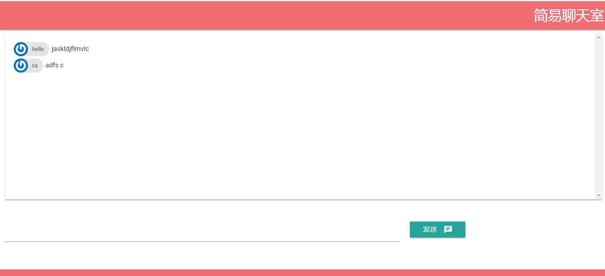

# chat_websocket

## 项目说明
使用Golang和WebSocket实现实时简单聊天室

websocket连接采用[gorilla/websocket](https://github.com/gorilla/websocket) 框架

## 项目使用

```
cd goproject/src
go get github.com/gorilla/websocket
mkdir websocket_chat
```
### go build
```
go run main.go
```
```
go build main.go
./main
```
### 测试
http://localhost:8000

