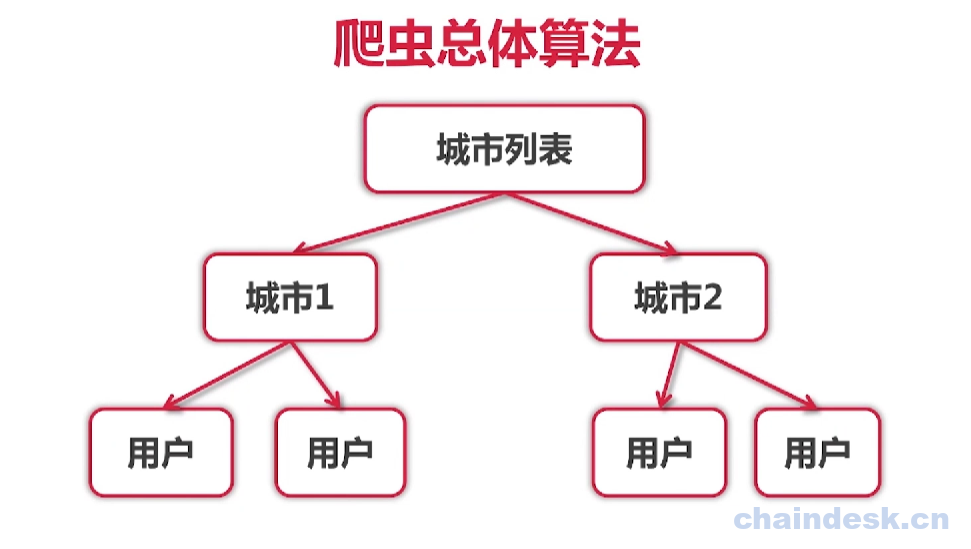

# Golang实现网络爬虫
- 单机爬虫
- 并发爬虫
- 分布式爬虫
- 爬虫框架
    - [gocolly/colly](https://github.com/gocolly/colly)
    - [goquery](https://github.com/PuerkitoBio/goquery) 
- 爬虫软件
    - [pholcus](https://github.com/henrylee2cn/pholcus)
## 网络爬虫
- 基本介绍
- 爬虫分类
    - 通用网络爬虫（General Purpose Web Crawler）
    - 聚焦网络爬虫（Focused Web Crawler）
    - 增量式网络爬虫（Incremental Web Crawler）
    - 深层网络爬虫（Deep Web Crawler）。
- 爬虫基础
    - golang 语法
    - 正则表达式语法
    - golang 网络处理
## 单机爬虫
- 爬虫整体算法
- 架构解析
### Beego框架爬虫
## 并发爬虫
- 爬虫整体算法
- 架构解析
## 分布式爬虫
- 爬虫整体算法
- 架构解析
## 爬虫框架/爬虫软件

## 以爬取[珍爱网](http://www.zhenai.com/zhenghun )信息为例

### 目标
爬取注册会员的信息.
### 实现思路
通过浏览珍爱网网站，获取信息如下：
- 首页上没有会员信息数据，
- 点击进入到城市列表页面：
- 点击进入进入某个城市页之后，可以看到该城市会员信息：
所以我们要想爬取珍爱网的会员信息，需要通过城市列表，爬取到用户
### 整体的思路
通过城市列表页，查看某个城市的信息，该城市下有用户信息，在用户界面还可以链接到另一个用户的界面。

### 实现步骤
1. 通过http协议获取整个城市列表页面的数据
2. 通过正则表达式匹配`<a>`标签对应的url和城市名称
3. 通过正则表达式来获取json数据
> 注意：使用json的基础：观察整个城市列表的页面，发现其实页面中的div数据，都是通过json数据渲染来的

## 参考资料

* https://www.chaindesk.cn/witbook/22
* https://github.com/rubyhan1314/gocrawl
