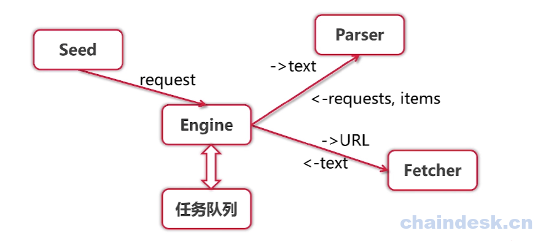
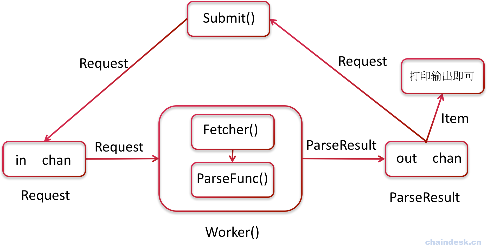

# 并发版爬虫

## 并发版爬虫架构分析
单任务爬虫实现效率很低。

而导致效率低的主要部分就是Fetcher，通过url然后获取文本数据，因为会涉及到远程网络传输。Parser虽然写了很多正则表达式，要解析文本，但是毕竟是在内存中，相对比较起来，还是要快很多。因为Fetcher的输出，就是Parser的输入，所以我们可以将这两部分合称为一个较大的模块。

提取出了一个worker,在并发的时候，就可以有很多个worker，我们再加入一个模块Scheduler，因为worker并发后，就需要面对一个问题，多对多的任务分配，很多个Request和很多个Worker。所有的worker由Scheduler来分配任务。

Worker的输入是Request，输出是Requests，和Items 。Engine收到了Requests和Items是另外的处理方法，对于Items我们目前只是打印出来，其实你也可以将它结构化后存入到数据库中，或者是展示到前端页面上。而这个Request，要送至到Scheduler，再由Scheduler会进行任务的分发，分配给响应的Worker进行处理。在每个模块的输入输出，在之前我们使用参数和返回值来实现，我们需要通过channel，因为我们需要用到并发，使用goroutine。

### 核心操作Scheduler实现：
- 让所有的Worker公用一个输入
- 结合队列并发分发Request

1. 让所有的Worker公用一个输入

注意：使用goroutine，否则会锁死：

2. 结合队列并发分发Request

## 实现
- 简单并发调度器

- 队列调度器

- 存储数据的结构

- Dockers+ElasticSearch

