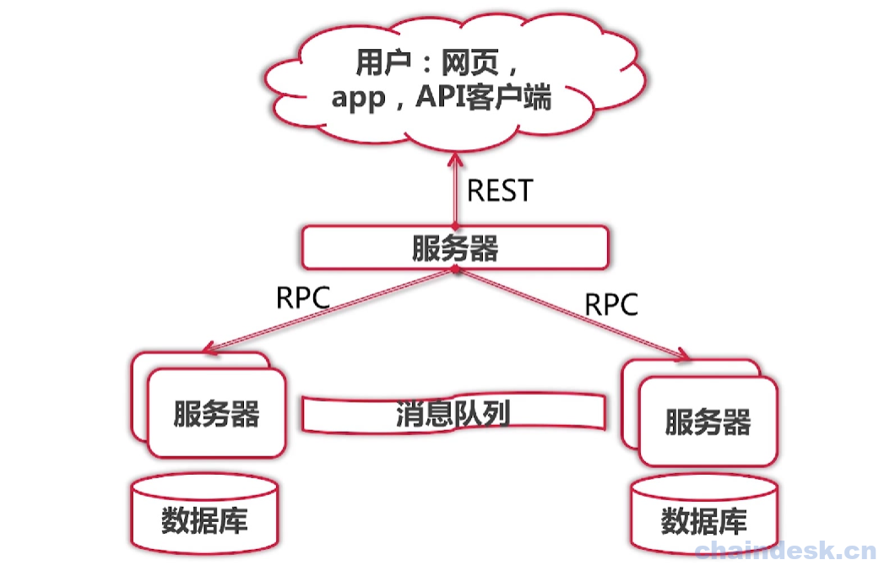
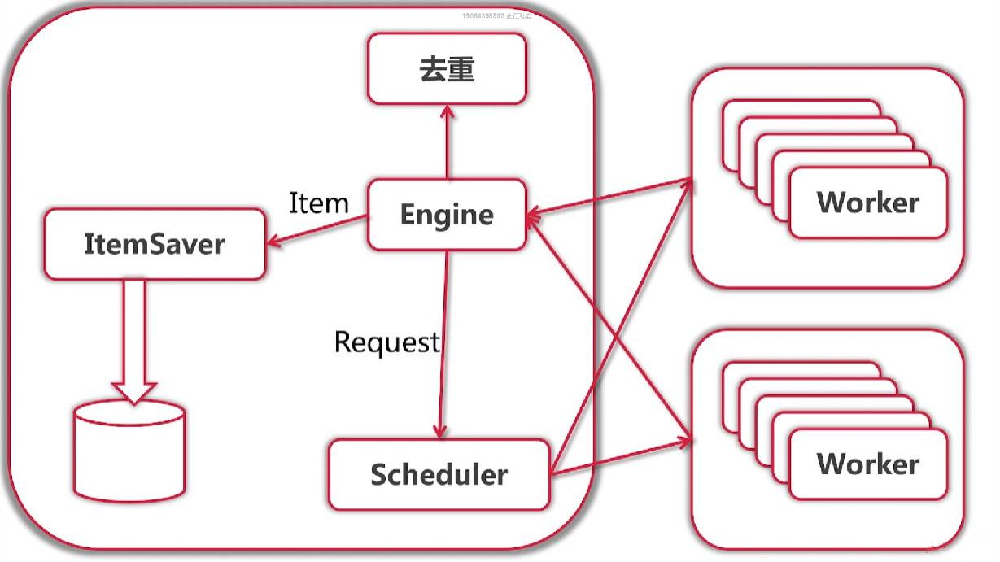
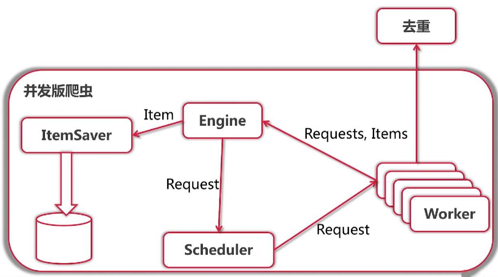
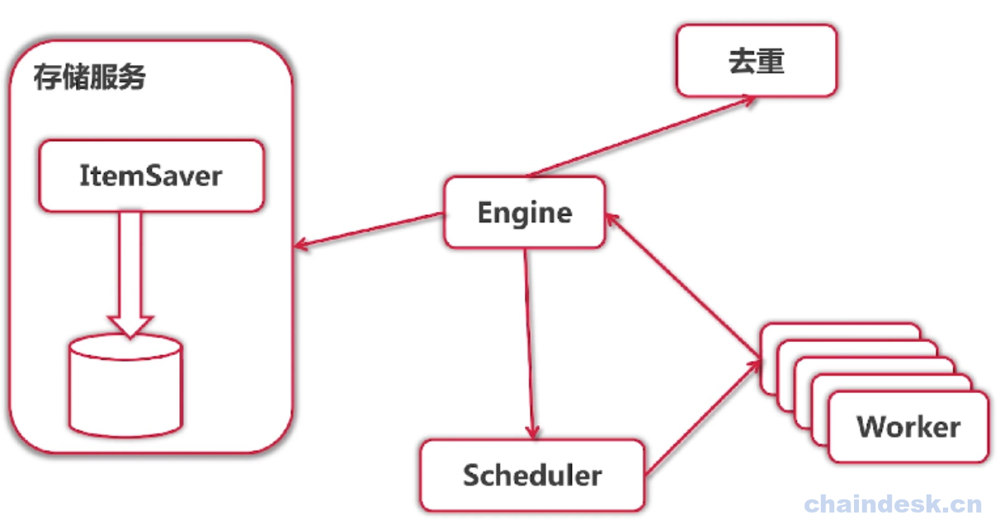
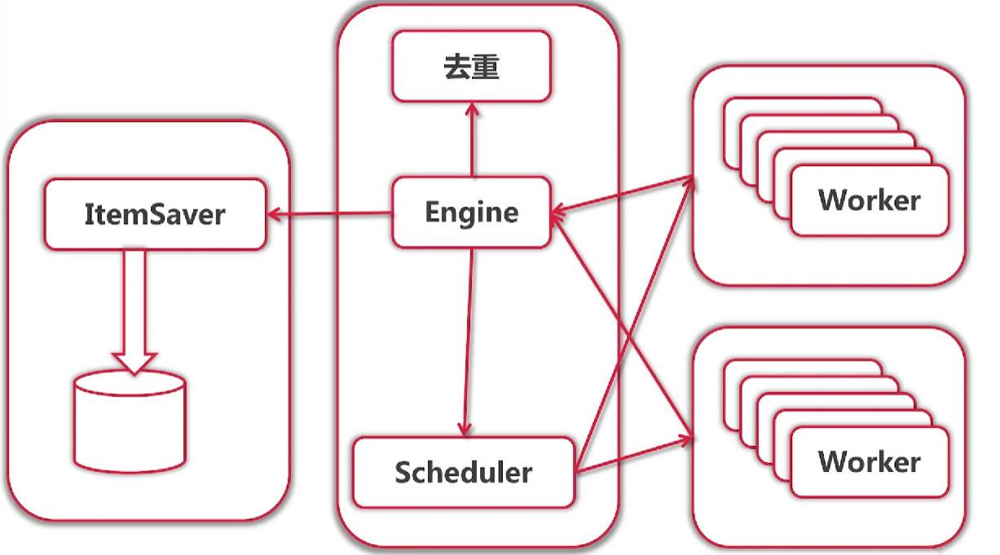

# 分布式爬虫
## 一、什么是分布式系统
分布式系统是一个硬件或软件组件分布在不同的网络计算机上，彼此之间仅仅通过消息传递进行通信和协调的系统。简单来说就是一群独立计算机集合共同对外提供服务，但是对于系统的用户来说，就像是一台计算机在提供服务一样。分布式意味着可以采用更多的普通计算机（相对于昂贵的大型机）组成分布式集群对外提供服务。计算机越多，CPU、内存、存储资源等也就越多，能够处理的并发访问量也就越大。

从分布式系统的概念中我们知道，各个主机之间通信和协调主要通过网络进行，所以分布式系统中的计算机在空间上几乎没有任何限制，这些计算机可能被放在不同的机柜上，也可能被部署在不同的机房中，还可能在不同的城市中，对于大型的网站甚至可能分布在不同的国家和地区。

## 二、分布式系统的特点
不同的资料介绍起分布式系统的特点，虽然说法不同，但都大同小异，此处我们针对于要实现的分布式爬虫，总结为以下3个特点：

- 多个节点
    - 容错性
    - 可扩展性(性能)
    - 固有分布性
- 消息传递
    - 节点具有私有存储
    - 易于开发
    - 可扩展性(功能)
    - 对比：并行计算
- 完成特定需求

消息传递的方法：

- REST
- RPC
- 中间件

## 分布式系统的结构图：

## 分布式爬虫项目架构
针对于目前我们遇到的问题，我们给与解决方案，来设计分布式爬虫项目的架构：

### 限流问题

​- 问题：

​ 单节点承受的流量是有限

​- 解决：

​ 将Worker放到不同的节点

### 去重问题

- 问题：

​ 单节点承受的去重数据量有限

​ 无法保存之前去重结果(因为是存入到内存(map))

- 解决：

​ 基于Key-Value Stroe(如Redis)进行分布式去重

### 数据存储问题

- 问题：

​ 存储部分的结构，技术栈和爬虫部分区别很大

​ 进一步优化需要特殊的ElasticSearch技术背景

- 解决：

​ 存储服务

### 分布式爬虫架构如下：

