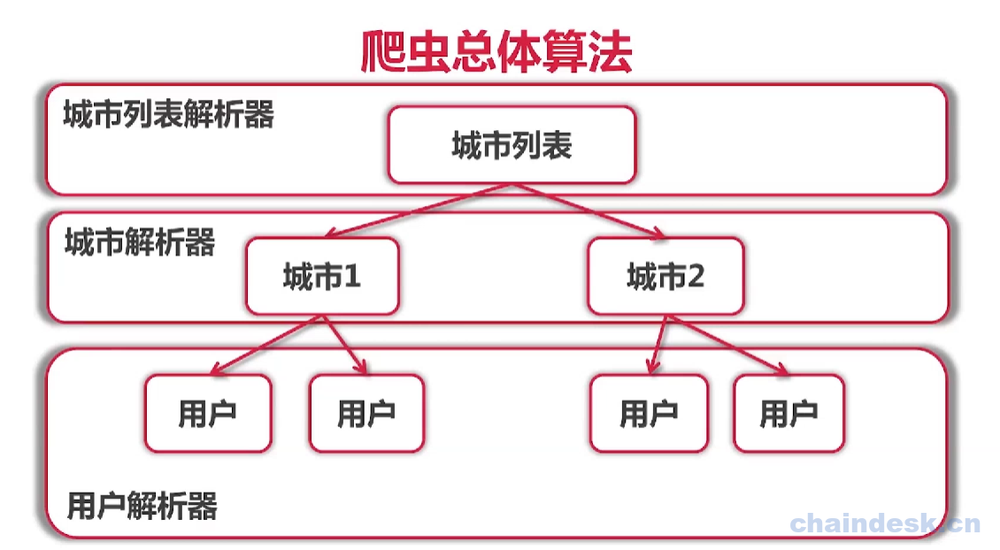

# 单任务爬虫实现

在整个实现过程中，我们每一个层级的页面，都需要有不同的解析器，城市列表有城市列表的解析器，城市页面有城市信息的解析器，用户页面有用户信息的解析器。

**解析器Parser：**
- 输入：utf-8编码的文本
- 输出：Request{URL，对应的Parser}列表，Item列表

## 单任务爬虫架构

架构说明：
- 首先要有Engine，来驱动整个程序。main函数调用

- 需要种子(seed)，一般就是起始页面URL。现在需要url和对应的parser。

- 当种子送到engine上后，先添加到任务队列，然后从队列中取出任务执行。
### 执行流程
 对url进行fetcher，获取这个url对应的utf-8的文本数据。然后将这个文本数据，通过parser解析器，就能够获取request列表和item列表。

使用http.Get获取内容 ​ 使用Encoding来转换编码 ​ 使用正则表达式来爬取数据 ​ 城市列表解析器 ​ 城市解析器 ​ 用户解析器