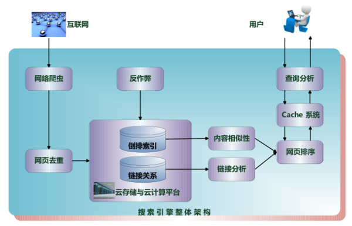

# 网络爬虫
## 什么是网络爬虫？
网络爬虫(Web crawler)，也叫网络蜘蛛，是一种按照一定的规则，自动地抓取万维网信息的程序或者脚本。

网络爬虫被广泛用于互联网搜索引擎或其他类似网站，可以自动采集所有其能够访问到的页面内容，以获取或更新这些网站的内容和检索方式。

> 其实通俗的讲就是通过程序去获取web页面上自己想要的数据，也就是自动抓取数据。其实就是数据采集。

## 爬虫的本质是什么？
**模拟浏览器打开网页，获取网页中我们想要的那部分数据**

浏览器打开网页的过程：

当你在浏览器中输入地址后，经过DNS服务器找到服务器主机，向服务器发送一个请求，服务器经过解析后发送给用户浏览器结果，包括html,js,css等文件内容，浏览器解析出来最后呈现给用户在浏览器上看到的结果

所以用户看到的浏览器的结果就是由HTML代码构成的，我们爬虫就是为了获取这些内容，通过分析和过滤html代码，从中获取我们想要资源。
## 爬虫的种类
网络爬虫按照系统结构和实现技术，大致可以分为以下几种类型：

- 通用网络爬虫（General Purpose Web Crawler）
- 聚焦网络爬虫（Focused Web Crawler）
- 增量式网络爬虫（Incremental Web Crawler）
- 深层网络爬虫（Deep Web Crawler）。 

实际的网络爬虫系统通常是几种爬虫技术相结合实现的。

### 1. 通用网络爬虫

通用网络爬虫又称全网爬虫（Scalable Web Crawler），爬行对象从一些种子 URL 扩充到整个 Web，主要为门户站点搜索引擎和大型 Web 服务提供商采集数据。 由于商业原因，它们的技术细节很少公布出来。 这类网络爬虫的爬行范围和数量巨大，对于爬行速度和存储空间要求较高，对于爬行页面的顺序要求相对较低，同时由于待刷新的页面太多，通常采用并行工作方式，但需要较长时间才能刷新一次页面。 虽然存在一定缺陷，通用网络爬虫适用于为搜索引擎搜索广泛的主题，有较强的应用价值 。

通用网络爬虫的结构大致可以分为页面爬行模块 、页面分析模块、链接过滤模块、页面数据库、URL 队列、初始 URL 集合几个部分。为提高工作效率，通用网络爬虫会采取一定的爬行策略。 常用的爬行策略有：深度优先策略、广度优先策略 。

- 深度优先策略：其基本方法是按照深度由低到高的顺序，依次访问下一级网页链接，直到不能再深入为止。 爬虫在完成一个爬行分支后返回到上一链接节点进一步搜索其它链接。 当所有链接遍历完后，爬行任务结束。 这种策略比较适合垂直搜索或站内搜索， 但爬行页面内容层次较深的站点时会造成资源的巨大浪费 。

-  广度优先策略：此策略按照网页内容目录层次深浅来爬行页面，处于较浅目录层次的页面首先被爬行。 当同一层次中的页面爬行完毕后，爬虫再深入下一层继续爬行。 这种策略能够有效控制页面的爬行深度，避免遇到一个无穷深层分支时无法结束爬行的问题，实现方便，无需存储大量中间节点，不足之处在于需较长时间才能爬行到目录层次较深的页面。

### 2. 聚焦网络爬虫

聚焦网络爬虫（Focused Crawler），又称主题网络爬虫（Topical Crawler），是指选择性地爬行那些与预先定义好的主题相关页面的网络爬虫。 和通用网络爬虫相比，聚焦爬虫只需要爬行与主题相关的页面，极大地节省了硬件和网络资源，保存的页面也由于数量少而更新快，还可以很好地满足一些特定人群对特定领域信息的需求 。

聚焦网络爬虫和通用网络爬虫相比，增加了链接评价模块以及内容评价模块。聚焦爬虫爬行策略实现的关键是评价页面内容和链接的重要性，不同的方法计算出的重要性不同，由此导致链接的访问顺序也不同 。

### 3. 增量式网络爬虫

增量式网络爬虫（Incremental Web Crawler）是 指对已下载网页采取增量式更新和只爬行新产生的或者已经发生变化网页的爬虫，它能够在一定程度上保证所爬行的页面是尽可能新的页面。 和周期性爬行和刷新页面的网络爬虫相比，增量式爬虫只会在需要的时候爬行新产生或发生更新的页面 ，并不重新下载没有发生变化的页面，可有效减少数据下载量，及时更新已爬行的网页，减小时间和空间上的耗费，但是增加了爬行算法的复杂度和实现难度。增量式网络爬虫的体系结构[包含爬行模块、排序模块、更新模块、本地页面集、待爬行 URL 集以及本地页面URL 集 。

增量式爬虫有两个目标：保持本地页面集中存储的页面为最新页面和提高本地页面集中页面的质量。 为实现第一个目标，增量式爬虫需要通过重新访问网页来更新本地页面集中页面内容，常用的方法有：

- 1) 统一更新法：爬虫以相同的频率访问所有网页，不考虑网页的改变频率；

- 2) 个体更新法：爬虫根据个体网页的改变频率来重新访问各页面；

- 3) 基于分类的更新法：爬虫根据网页改变频率将其分为更新较快网页子集和更新较慢网页子集两类，然后以不同的频率访问这两类网页 。

为实现第二个目标，增量式爬虫需要对网页的重要性排序，常用的策略有：广度优先策略、PageRank 优先策略等。IBM 开发的 WebFountain是一个功能强大的增量式网络爬虫，它采用一个优化模型控制爬行过程，并没有对页面变化过程做任何统计假设，而是采用一种自适应的方法根据先前爬行周期里爬行结果和网页实际变化速度对页面更新频率进行调整。北京大学的天网增量爬行系统旨在爬行国内 Web，将网页分为变化网页和新网页两类，分别采用不同爬行策略。 为缓解对大量网页变化历史维护导致的性能瓶颈，它根据网页变化时间局部性规律，在短时期内直接爬行多次变化的网页 ，为尽快获取新网页，它利用索引型网页跟踪新出现网页 。

### 4. Deep Web 爬虫

Web 页面按存在方式可以分为表层网页（Surface Web）和深层网页（Deep Web，也称 Invisible Web Pages 或 Hidden Web）。 表层网页是指传统搜索引擎可以索引的页面，以超链接可以到达的静态网页为主构成的 Web 页面。Deep Web 是那些大部分内容不能通过静态链接获取的、隐藏在搜索表单后的，只有用户提交一些关键词才能获得的 Web 页面。例如那些用户注册后内容才可见的网页就属于 Deep Web。 2000 年 Bright Planet 指出：Deep Web 中可访问信息容量是 Surface Web 的几百倍，是互联网上最大、发展最快的新型信息资源 。

