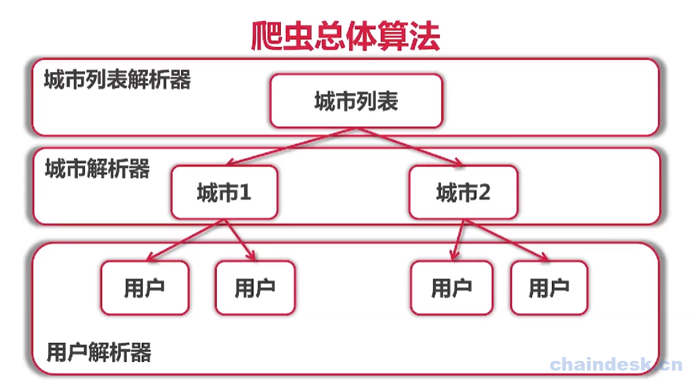

# 单任务爬虫的架构
## 项目的架构
为了让整个代码更加的结构化，需要设计一下项目的架构。

## 爬虫整体算法
在整个实现过程中，我们每一个层级的页面，都需要有不同的解析器，城市列表有城市列表的解析器，城市页面有城市信息的解析器，用户页面有用户信息的解析器。

### 解析器Parser：
- 输入：utf-8编码的文本
- 输出：Request{URL，对应的Parser}列表，Item列表

## 整体架构：

- 首先要有Engine，来驱动整个程序。

- 需要种子，一般就是起始页面，比如之前的：http://www.zhenai.com/zhenghun ，现在我们需要包装一下，不止需要url，还需要对应的parser。

- 当种子送到engine上后，先添加到任务队列，然后从队列中取出任务执行。

- 执行的时候，对url进行fetcher，获取这个url对应的utf-8的文本。

- 然后将这个文本，通过parser解析器，就能够获取request列表和item列表。
